# Class Diagram - HeraUEBA Framework

## Diagrama de Clases (Mermaid)

```mermaid
classDiagram
    %% === Core: Agent Base ===
    class BaseAgent {
        <<abstract>>
        +name: str
        +version: str
        +description: str
        +skills_required: list[str]
        +permissions: list[str]
        +run(task: dict) dict*
    }
    
    class AgentRegistry {
        +registry: dict[str, type[BaseAgent]]
        +register(agent_cls: type[BaseAgent]) void
        +get(name: str) type[BaseAgent] | None
        +list() list[str]
    }
    
    %% === Core: Skill Base ===
    class BaseSkill {
        <<abstract>>
        +name: str
        +version: str
        +input_schema: dict
        +output_schema: dict
        +rate_limit: str | None
        +permissions: list[str]
        +run(params: dict) dict*
    }
    
    class SkillRegistry {
        +registry: dict[str, type[BaseSkill]]
        +register(skill_cls: type[BaseSkill]) void
        +get(name: str) type[BaseSkill] | None
        +list() list[str]
    }
    
    %% === Core: Orchestrator ===
    class Router {
        +route(task: dict) str
        +select_agent(task: dict, registry: AgentRegistry) str
    }
    
    class Planner {
        +plan(task: dict) list[dict]
        +decompose(task: dict) list[dict]
    }
    
    class Executor {
        +execute(plan: list[dict], agents: AgentRegistry) dict
        +execute_step(step: dict) dict
        +handle_retry(step: dict, attempts: int) dict
        +handle_fallback(step: dict) dict
    }
    
    %% === Core: Memory ===
    class MemoryManager {
        +short_term: ShortTermMemory
        +long_term: LongTermMemory
        +store(key: str, value: any, ttl: int | None) void
        +retrieve(key: str) any
        +search(query: str, k: int) list[any]
        +clear_session() void
        +persist() void
    }
    
    class ShortTermMemory {
        +context: dict
        +history: list[dict]
        +push(message: dict) void
        +get_context() dict
        +clear() void
    }
    
    class LongTermMemory {
        +store_embedding(text: str, metadata: dict) str
        +similarity_search(query: str, k: int) list[dict]
        +get(id: str) dict | None
        +delete(id: str) void
    }
    
    %% === Core: LLM Gateway ===
    class ProviderRouter {
        +providers: dict[str, LLMProvider]
        +select_provider(task: dict) str
        +call(model: str, messages: list[dict], **kwargs) dict
    }
    
    class LLMProvider {
        <<abstract>>
        +name: str
        +models: list[str]
        +complete(messages: list[dict], **kwargs) dict*
        +count_tokens(text: str) int
    }
    
    class CostTracker {
        +track_call(provider: str, model: str, input_tokens: int, output_tokens: int) void
        +get_cost_by_agent(agent: str) float
        +get_cost_by_skill(skill: str) float
        +get_total_cost() float
        +get_usage_report() dict
    }
    
    %% === Core: Security ===
    class Permissions {
        +rbac: dict[str, list[str]]
        +check_permission(agent: str, action: str) bool
        +grant(agent: str, permission: str) void
        +revoke(agent: str, permission: str) void
    }
    
    class Guardrails {
        +validate_input(input_data: dict) tuple[bool, str | None]
        +sanitize_output(output_data: dict) dict
        +check_policy(action: str, context: dict) bool
        +filter_sensitive(data: dict) dict
    }
    
    %% === Core: Observability ===
    class Logger {
        +info(message: str, **kwargs) void
        +warning(message: str, **kwargs) void
        +error(message: str, **kwargs) void
        +debug(message: str, **kwargs) void
        +audit(event: str, **kwargs) void
    }
    
    class Tracer {
        +start_span(operation: str) str
        +end_span(span_id: str, result: dict | None) void
        +trace_decision(decision: dict) void
        +get_trace(trace_id: str) dict
    }
    
    %% === Agents ===
    class ResearchAgent {
        +name: str = "research_agent"
        +run(task: dict) dict
    }
    
    class CodingAgent {
        +name: str = "coding_agent"
        +run(task: dict) dict
    }
    
    %% === Skills ===
    class WebSearchSkill {
        +name: str = "web_search"
        +run(params: dict) dict
    }
    
    class CodeExecutorSkill {
        +name: str = "code_executor"
        +run(params: dict) dict
    }
    
    class DbQuerySkill {
        +name: str = "db_query"
        +run(params: dict) dict
    }
    
    class DocumentGeneratorSkill {
        +name: str = "document_generator"
        +run(params: dict) dict
    }
    
    %% === HeraUEBA Domain ===
    class User {
        +user_id: int
        +username: str
        +unit_id: int
        +role_id: int
        +is_critical_user() bool
    }
    
    class Role {
        +role_id: int
        +role_name: str
    }
    
    class Unit {
        +unit_id: int
        +unit_name: str
        +is_critical: bool
    }
    
    class Alert {
        +alert_id: int
        +severity: str
        +alert_status: str
        +explain() str
    }
    
    class DecisionPath {
        +path_id: int
        +rule_explanation: str
    }
    
    class QuarantineAction {
        +action_id: int
        +two_step_confirmed: bool
        +simulated: bool
        +blocked_due_to_critical_unit: bool
    }
    
    %% Inheritance
    BaseAgent <|-- ResearchAgent
    BaseAgent <|-- CodingAgent
    BaseSkill <|-- WebSearchSkill
    BaseSkill <|-- CodeExecutorSkill
    BaseSkill <|-- DbQuerySkill
    BaseSkill <|-- DocumentGeneratorSkill
    LLMProvider <|-- LocalLLMProvider
    LLMProvider <|-- OpenAILLMProvider
    LLMProvider <|-- AnthropicLLMProvider
    
    %% Relations
    AgentRegistry *-- BaseAgent
    SkillRegistry *-- BaseSkill
    Router --> AgentRegistry
    Executor --> Planner
    Executor --> AgentRegistry
    MemoryManager *-- ShortTermMemory
    MemoryManager *-- LongTermMemory
    ProviderRouter *-- LLMProvider
    ResearchAgent ..> WebSearchSkill : uses
    ResearchAgent ..> DocumentGeneratorSkill : uses
    CodingAgent ..> CodeExecutorSkill : uses
```

## Notas

- Framework (core/agents/skills): muestra contratos, orquestación, memoria, LLM, seguridad, observabilidad.
- Dominio HeraUEBA: entidades clave alineadas a ERD (usuarios, unidades críticas, alertas con explicabilidad, acciones de aislamiento con guardrails).
- Herencia/uso refleja estructura actual (stubs) y diseño futuro.