# Diagrama de Componentes — HeraUEBA

Diagrama de componentes del proyecto. Cubre la plataforma HeraUEBA (definida en
`README.md` y `docs/srs_heraueba.md`) y el framework agéntico que la soporta
(`core/`, `agents/`, `skills/`, `interfaces/`, `tools/`, `config/`,
`evaluations/`).

## Archivos

*   **`docs/components.drawio`** — versión editable (recomendada). Ábrela con
    draw.io Desktop o en <https://app.diagrams.net> para ver/ajustar el diagrama.
*   Fuente alternativa en Mermaid (abajo), útil para diff en texto.

## Diagrama (fuente Mermaid)

```mermaid
flowchart TB
    CISO["CISO / Director TI"]
    COORD["Coordinador SOC"]
    ANAL["Analista Junior SOC"]

    subgraph PLAT["HeraUEBA · Monitoreo analítico (sector salud)"]
        subgraph UI["interfaces/"]
            DASH["Dashboard Web (Streamlit)<br/>Alertas Rojas priorizadas · filtro 24h · baja densidad"]
            API["API REST (FastAPI)"]
            CLI["CLI"]
            CHAT["Chat UI"]
        end
        SSO["Keycloak SSO + Active Directory"]
        subgraph AI["Motor híbrido de IA"]
            DT["Árbol de Decisión<br/>(fuerza bruta)"]
            IF["Isolation Forest<br/>(viajes imposibles)"]
            EXPL["Registro lógico explicable<br/>(caja blanca · FR-004)"]
        end
        WHL["Whitelist Geográfica<br/>(FR-008)"]
        ISO["Aislamiento Seguro 2 pasos<br/>(FR-005/006/007)"]
        RBA[("Dataset RBA<br/>enriquecido (IPinfo)")]
        DB[("Base de Datos Local<br/>cuarentena simulada + whitelist")]
    end

    subgraph CORE["core/ · Infraestructura compartida"]
        subgraph ORQ["core/orchestrator"]
            ROUTER["Router<br/>(qué agente atiende)"]
            PLANNER["Planner<br/>(descompone tareas)"]
            EXEC["Executor<br/>(reintentos y fallbacks)"]
        end
        subgraph AB["core/agent_base"]
            BA["BaseAgent"]
            AR["AgentRegistry"]
        end
        subgraph SB["core/skill_base"]
            BSK["BaseSkill"]
            SR["SkillRegistry"]
        end
        subgraph MEM["core/memory"]
            MGR["MemoryManager"]
            ST["ShortTerm (sesión)"]
            LT["LongTerm (persistente)"]
        end
        subgraph LLMG["core/llm_gateway"]
            PROV["ProviderRouter"]
            COST["CostTracker"]
        end
        subgraph SEC["core/security"]
            PERM["Permissions (RBAC)"]
            GRD["Guardrails"]
        end
        subgraph OBS["core/observability"]
            TRC["Tracer"]
            LGR["Logger"]
        end
    end

    subgraph AGENTS["agents/"]
        RA["research_agent"]
        CA["coding_agent"]
    end

    subgraph SKLL["skills/"]
        WS["web_search"]
        CE["code_executor"]
        DQ["db_query"]
        DG["document_generator"]
    end

    subgraph EXTL["Integraciones · Config · Evaluación"]
        GH["tools/github_client"]
        SL["tools/slack_client"]
        CFG["config/<br/>agents.yaml · skills.yaml · environments/"]
        EVAL["evaluations/<br/>agent_benchmarks · skill_tests"]
    end

    %% --- Flujo de la plataforma HeraUEBA ---
    CISO --> DASH
    COORD --> DASH
    ANAL --> DASH
    SSO -.autenticación RBAC.-> DASH
    RBA --> DT
    RBA --> IF
    DT --> EXPL
    IF --> EXPL
    EXPL --> DASH
    DB --> DASH
    DASH --> WHL
    WHL --> DB
    DASH --> ISO
    ISO --> DB

    %% --- Interfaces hacia el orquestador ---
    DASH --> API
    CLI --> API
    CHAT --> API
    API --> ROUTER

    %% --- Orquestación ---
    ROUTER --> PLANNER
    PLANNER --> EXEC
    ROUTER --> AR
    AR --> RA
    AR --> CA
    EXEC --> RA
    EXEC --> CA
    RA -.hereda de.-> BA
    CA -.hereda de.-> BA
    EXEC --> SR

    %% --- Agentes usan skills ---
    RA --> WS
    RA --> DG
    CA --> CE
    DQ --> DB
    WS -.usa.-> GH
    DQ -.usa.-> SL

    %% --- Infraestructura transversal ---
    ROUTER -.config.-> CFG
    BA --> MGR
    MGR --> ST
    MGR --> LT
    EXEC -.enruta llamadas a LLM.-> PROV
    PROV -.registra costo/uso.-> COST
    EXEC -.validan.-> GRD
    EXEC -.aplican permisos.-> PERM
    EXEC -.traceado.-> TRC
    EXEC -.log.-> LGR
    EVAL -.verifica.-> RA
    EVAL -.verifica.-> WS
```

## Notas

*   **Plataforma HeraUEBA (parte superior):** componentes de dominio descritos en
    `README.md` y `srs_heraueba.md` (dashboard Streamlit, Keycloak SSO, motor
    híbrido de IA, whitelist geográfica, aislamiento de 2 pasos, dataset RBA y BD
    local).
*   **Framework agéntico (parte inferior):** estructura real del repositorio.
    Las interfaces exponen el orquestador; el orquestador selecciona agentes
    (`Router`), descompone tareas (`Planner`) y las ejecuta (`Executor`); los
    agentes resuelven tareas mediante skills y comparten infraestructura
    transversal (memoria, LLM gateway, seguridad y observabilidad).