# Entity Relationship Diagram (ERD) - HeraUEBA

## Diagrama ER (Mermaid)

```mermaid
erDiagram
    %% === ROLES Y UNIDADES ===
    ROLES {
        int role_id PK "ID único del rol"
        varchar role_name UK "Nombre del rol (Analyst_Junior, Coordinator_SOC)"
        varchar description "Descripción del rol"
        timestamp created_at
        timestamp updated_at
    }
    
    UNITS {
        int unit_id PK "ID único de unidad"
        varchar unit_name UK "Nombre de unidad"
        boolean is_critical "Indica si es unidad crítica (UCI, Quirófanos, Urgencias)"
        enum unit_type "Tipo: ICU, OR, ER, OTHER"
        varchar department "Departamento asociado"
        timestamp created_at
        timestamp updated_at
    }
    
    USERS {
        int user_id PK "ID único del usuario"
        varchar username UK "Nombre de usuario"
        varchar email UK "Correo electrónico"
        varchar full_name "Nombre completo"
        int unit_id FK "Unidad a la que pertenece"
        int role_id FK "Rol asignado (RBAC)"
        boolean active "Estado del usuario"
        varchar keycloak_id UK "ID en Keycloak (SSO)"
        varchar ad_guid UK "GUID en Active Directory"
        timestamp last_login_at
        timestamp created_at
        timestamp updated_at
    }
    
    %% === EVENTOS DE AUTENTICACIÓN ===
    AUTH_EVENTS {
        bigint event_id PK "ID único del evento"
        int user_id FK "Usuario asociado (puede ser null para intentos fallidos)"
        varchar username_attempt "Usuario intentado (para fallidos)"
        timestamp event_timestamp "Fecha y hora del evento"
        varchar ip_address "Dirección IP"
        varchar geo_country "País (ISO 2/3)"
        varchar geo_region "Región/Estado"
        varchar geo_city "Ciudad"
        varchar asn "Número de Sistema Autónomo (ASN)"
        varchar isp "Proveedor de Internet"
        boolean is_vpn "Indicador de VPN/Proxy"
        boolean is_tor "Indicador de Tor"
        varchar outcome "Resultado: success, failed, blocked"
        varchar auth_method "Método: password, mfa, sso"
        int failure_count_window "Conteo fallidos en ventana (para detección)"
        jsonb raw_json "Payload original de Keycloak (IPinfo enriquecido)"
        timestamp ingested_at
    }
    
    %% === ALERTAS DE UEBA ===
    ALERTS {
        bigint alert_id PK "ID único de alerta"
        bigint event_id FK "Evento que generó la alerta (opcional)"
        int user_id FK "Usuario afectado"
        enum severity "Severidad: CRITICAL, HIGH, MEDIUM, LOW"
        enum alert_status "Estado: NEW, INVESTIGATING, ESCALATED, DISMISSED, ISOLATED, FALSE_POSITIVE"
        enum model_type "Modelo: DECISION_TREE, ISOLATION_FOREST, HYBRID"
        varchar title "Título de la alerta"
        text description "Descripción de la alerta"
        float risk_score "Puntaje de riesgo (0-1)"
        timestamp alert_timestamp "Momento de detección"
        int investigated_by FK "Analista que investigó (null si no investigada)"
        timestamp investigated_at
        int dismissed_by FK "Quien descartó (null si activa)"
        timestamp dismissed_at
        varchar dismissal_reason "Razón de descarte"
        timestamp created_at
        timestamp updated_at
    }
    
    %% === EXPLICABILIDAD - CAMINO DE DECISIÓN (CAJA BLANCA) ===
    DECISION_PATHS {
        bigint path_id PK "ID único del nodo del camino"
        bigint alert_id FK "Alerta asociada"
        int node_index "Orden del nodo en el camino (0-based)"
        varchar node_id "ID del nodo en árbol (ej. root, node_001)"
        varchar node_name "Nombre del nodo"
        varchar split_feature "Característica evaluada (ip_count, failures, time_gap, etc.)"
        varchar split_condition "Condición lógica (>, <, ==, IN, BETWEEN)"
        varchar split_value "Valor de comparación"
        varchar node_outcome "Resultado: true/false/leaf"
        boolean is_leaf "Es nodo hoja"
        varchar leaf_class "Clase: ANOMALOUS, NORMAL, SUSPICIOUS"
        varchar rule_explanation "Explicación legible para auditoría (FR-004)"
        float confidence "Confianza del nodo"
        timestamp created_at
    }
    
    %% === WHITELIST GEOGRÁFICA ===
    WHITELIST_ENTRIES {
        int whitelist_id PK "ID único de excepción"
        int user_id FK "Usuario con excepción"
        varchar country "País permitido (ISO 2/3)"
        varchar region "Región permitida (opcional)"
        varchar city "Ciudad permitida (opcional)"
        varchar asn "ASN permitido (opcional - VPN específica)"
        varchar ip_range_start "Rango IP inicio (opcional)"
        varchar ip_range_end "Rango IP fin (opcional)"
        date start_date "Fecha inicio validez"
        date end_date "Fecha fin validez"
        boolean active "Entrada activa"
        text reason "Justificación (congreso, VPN legítima, etc.)"
        int created_by FK "Coordinador SOC que creó"
        timestamp created_at
        timestamp updated_at
    }
    
    %% === ACCIONES DE AISLAMIENTO (SIMULADO) ===
    QUARANTINE_ACTIONS {
        bigint action_id PK "ID único de acción"
        int user_id FK "Usuario a aislar"
        bigint alert_id FK "Alerta que motivó el aislamiento"
        enum action_status "Estado: PENDING, APPROVED, REJECTED, EXECUTED, CANCELLED"
        text reason "Motivo del aislamiento"
        int requested_by FK "Quien solicitó (debe ser Coordinador SOC)"
        timestamp requested_at
        int approved_by FK "Quien aprobó (Coordinador SOC)"
        timestamp approved_at
        boolean two_step_confirmed "Confirmación de 2 pasos (FR-006)"
        timestamp two_step_confirmed_at "Momento de confirmación 2 pasos"
        boolean blocked_due_to_critical_unit "Bloqueado por unidad crítica (FR-007)"
        text rejection_reason "Razón de rechazo (si aplica)"
        boolean simulated "Acción simulada (MVP - BR-001)"
        timestamp executed_at "Momento de ejecución simulada en BD"
        timestamp created_at
        timestamp updated_at
    }
    
    %% === AUDITORÍA Y TRAZABILIDAD (NFR-004) ===
    AUDIT_LOGS {
        bigint log_id PK "ID único de log de auditoría"
        varchar actor_username "Usuario que realizó acción"
        int actor_user_id FK "ID del actor (opcional)"
        enum action_type "Acción: CREATE, READ, UPDATE, DELETE, APPROVE, REJECT, LOGIN, LOGOUT"
        varchar resource_type "Recurso: USER, ALERT, WHITELIST, QUARANTINE, DECISION_PATH"
        varchar resource_id "ID del recurso afectado"
        text action_description "Descripción legible de la acción"
        jsonb details "Detalles adicionales (antes/después, IP, user_agent)"
        varchar client_ip "IP desde donde se realizó"
        varchar user_agent "Navegador/Cliente"
        boolean success "Acción exitosa"
        text failure_reason "Razón de fallo"
        timestamp created_at
    }
    
    %% === TABLA DE CONFIGURACIÓN DE REGLAS (Opcional) ===
    DETECTION_RULES {
        int rule_id PK "ID de regla de detección"
        varchar rule_name UK "Nombre de regla"
        enum model_type "Modelo asociado"
        text rule_condition "Condición lógica"
        enum severity "Severidad asignada"
        boolean active "Regla activa"
        text description "Descripción de la regla"
        timestamp created_at
        timestamp updated_at
    }
    
    %% === RELACIONES ===
    %% Roles - Users (1:N)
    ROLES ||--o{ USERS : "asigna"
    
    %% Units - Users (1:N)
    UNITS ||--o{ USERS : "pertenece_a"
    
    %% Users - AuthEvents (1:N)
    USERS ||--o{ AUTH_EVENTS : "genera_eventos"
    
    %% Users - Alerts (1:N)
    USERS ||--o{ ALERTS : "recibe"
    
    %% AuthEvents - Alerts (0..1:N opcional)
    AUTH_EVENTS ||--o{ ALERTS : "origina"
    
    %% Alerts - DecisionPaths (1:N)
    ALERTS ||--|{ DECISION_PATHS : "explicado_por"
    
    %% Users - WhitelistEntries (1:N)
    USERS ||--o{ WHITELIST_ENTRIES : "tiene_excepcion"
    
    %% Users (created_by) - WhitelistEntries (1:N)
    USERS ||--o{ WHITELIST_ENTRIES : "creado_por"
    
    %% Users - Alerts (investigated_by) (1:N)
    USERS ||--o{ ALERTS : "investiga"
    
    %% Users - Alerts (dismissed_by) (1:N)
    USERS ||--o{ ALERTS : "descarta"
    
    %% Users - QuarantineActions (user) (1:N)
    USERS ||--o{ QUARANTINE_ACTIONS : "aislado"
    
    %% Alerts - QuarantineActions (1:N)
    ALERTS ||--o{ QUARANTINE_ACTIONS : "motiva"
    
    %% Users - QuarantineActions (requested_by) (1:N)
    USERS ||--o{ QUARANTINE_ACTIONS : "solicita"
    
    %% Users - QuarantineActions (approved_by) (1:N)
    USERS ||--o{ QUARANTINE_ACTIONS : "aprueba"
    
    %% Users - AuditLogs (actor) (1:N)
    USERS ||--o{ AUDIT_LOGS : "registra"
```

## Notas del Diseño

### Decisiones Clave

1. **Modelo Relacional** - Cumple con ACID, integridad referencial y trazabilidad (NFR-004, Ley 1581/HIPAA). Ver justificación previa.

2. **Separación Event → Alert** - Un evento puede generar 0..N alertas (múltiples modelos) o alerta puede derivarse de análisis. Permite flexibilidad entre datos simulados y producción.

3. **DecisionPaths normalizado (1:N)** - Almacena cada nodo del árbol de decisión por separado para permitir consultas de auditoría (FR-004). Esto facilita demostrar el "camino exacto" y generar reportes regulatorios.

4. **JSONB para campos flexibles**:
- `auth_events.raw_json`: Preserva payload original de Keycloak + enriquecimiento IPinfo (AQ-02)
- `audit_logs.details`: Cambios antes/después, contexto completo (inmutable para auditoría)
- Evita romper esquema ante cambios en logs

5. **Soporte para AQ-01 (Unidades Críticas)** - Tabla `UNITS` con `is_critical` + flags por tipo (ICU/OR/ER). Permite mapear desde AD/CSV en MVP y escalar a sincronización automática. Columna `users.ad_guid` facilita integración con Active Directory.

6. **AQ-03 (VPN/ASN Granularidad)** - `whitelist_entries` soporta whitelist por: país/región/ciudad, ASN específico, o rangos IP. También `auth_events` captura `asn`, `is_vpn`, `is_tor` para mejor discriminación.

7. **Seguridad y Cumplimiento (BR-001, BR-002)**:
- `quarantine_actions.simulated = true` para MVP (garantiza no bloqueo automático)
- `two_step_confirmed` + timestamp obligatorio conceptualmente antes de ejecución
- `blocked_due_to_critical_unit` registra cuando se impide acción (FR-007) - trazable
- `audit_logs` captura TODO (quién, cuándo, qué, IP, resultado)

8. **RBAC (NFR-003)** - `roles` + FK en `users`. Endpoints deben validar rol (Coordinador SOC único con permisos resolutivos).

9. **Optimización para consultas UI**:
- Índices sugeridos (no mostrados): `alerts(severity, alert_status, alert_timestamp)`, `alerts(user_id)`, `auth_events(event_timestamp, user_id)`, `decision_paths(alert_id, node_index)`, `whitelist_entries(active, start_date, end_date)`
- Filtro 24h (FR-002) usa `alert_timestamp >= NOW()-24h` o `event_timestamp`

### Notas sobre MVP vs Producción

| Aspecto | MVP (simulado) | Post-MVP (producción) |
|---|---|---|
| Datos | Dataset RBA enriquecido (cargado manual) | Webhooks Keycloak + IPinfo en tiempo real |
| Aislamiento | `simulated=true`, solo BD local | Integración real Keycloak (revocar tokens) - fuera alcance MVP |
| Unidades | CSV cargado a tabla UNITS/USERS | Sincronización AD/HR (AQ-01) |
| Volumen | Pequeño | ~110k eventos/día - considerar particionado por `event_timestamp` |

### Cardinalidades Clave

- Un usuario puede tener múltiples alertas, eventos, whitelist, acciones de cuarentena.
- Una alerta DEBE tener 1+ nodos en `decision_paths` (explicabilidad obligatoria FR-004) - relación 1 a muchos con FK `alert_id`.
- Quarantine action vincula `user_id + alert_id + requested_by + approved_by` (todos FKs a USERS) - permite trazabilidad completa.
- `investigated_by`, `dismissed_by`, `requested_by`, `approved_by`, `created_by` permiten auditoría de actores humanos.